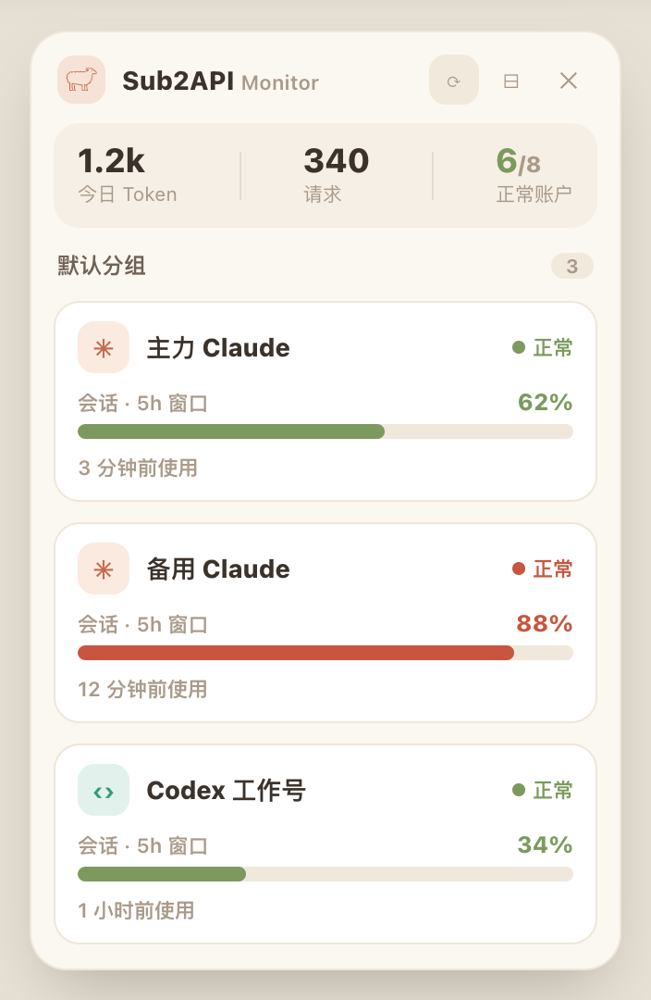
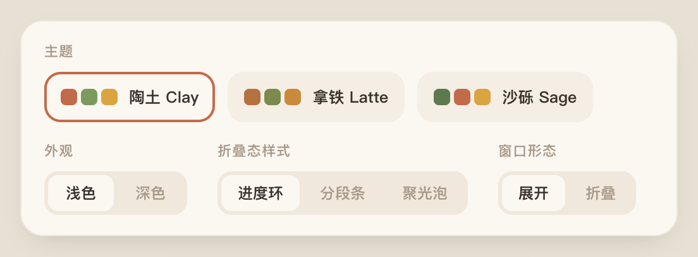
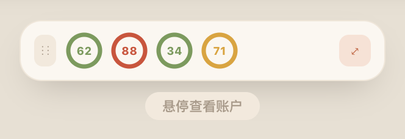
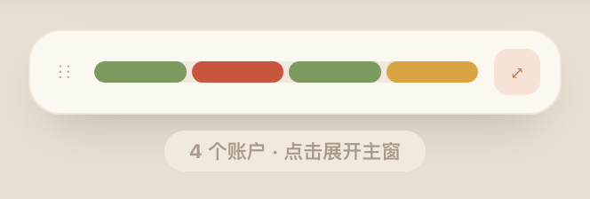
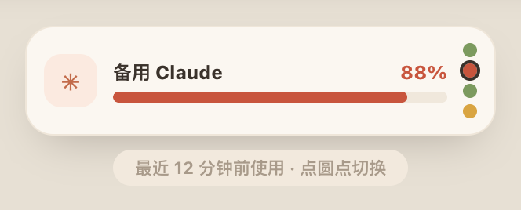

# Sub2API Monitor · 用户手册

一个**无边框、常驻置顶**的桌面悬浮窗，实时盯着你 [Sub2API](https://github.com/Wei-Shaw/sub2api)
后台里**状态正常（active）**账户的额度用量、用量窗口与最近使用，并汇总今日 Token / 请求。
一次登录，长期免登录；暖色圆润界面，三套主题、明暗可切；可折叠成迷你条挂在屏幕角落。

> **平台状态**：Windows = v1.0 交付目标 ✅ ｜ macOS = 已支持（构建/接力见
> [docs/HANDOVER-macOS.md](docs/HANDOVER-macOS.md)）｜ iOS 伴侣 App = 远期规划。

---

## 目录

1. [安装](#1-安装)
2. [首次使用（三步）](#2-首次使用三步)
3. [主界面说明](#3-主界面说明)
4. [外观设置（主题切换）](#4-外观设置主题切换)
5. [折叠模式](#5-折叠模式)
6. [系统托盘](#6-系统托盘)
7. [更换服务器 / 重新登录](#7-更换服务器--重新登录)
8. [隐私与安全](#8-隐私与安全)
9. [常见问题（FAQ）](#9-常见问题faq)
10. [从源码运行 / 参与开发](#10-从源码运行--参与开发)

---

## 1. 安装

### 方式 A：下载安装包（推荐）

到项目的 [**Releases**](https://github.com/IdiosyncraticDragon/sub2api-monitor/releases) 下载对应平台的安装包：

| 平台 | 文件 | 说明 |
| --- | --- | --- |
| Windows | `Sub2API Monitor Setup x.y.z.exe` | 安装版（NSIS） |
| Windows | `Sub2API Monitor x.y.z.exe` | 免安装便携版（Portable） |
| macOS | `Sub2API Monitor-x.y.z.dmg` | 拖入「应用程序」即可 |
| macOS | `Sub2API Monitor-x.y.z-mac.zip` | 解压即用 |

> **macOS 首次打开提示「无法验证开发者」**：应用未做苹果签名/公证，属正常现象。
> 在 **访达** 里右键应用 →「打开」→ 再点「打开」一次即可；或到
> **系统设置 → 隐私与安全性** 里点「仍要打开」。

### 方式 B：从源码构建

需要 Node.js 18+，详见 [第 10 节](#10-从源码运行--参与开发)。

---

## 2. 首次使用（三步）

第一次启动会依次引导你完成配置，之后每次开机自动恢复，无需重复操作。

1. **设置服务器地址**
   弹出「设置 Sub2API 服务器」窗口，填入你的后台地址（例如
   `https://your-sub2api.example.com`），点「保存并继续」。

2. **登录一次**
   随后弹出登录窗口，里面就是你的 Sub2API 后台登录页。像平时一样**用账号登录**即可。
   登录成功后，应用会自动读取并**加密保存**你的登录凭证，窗口自动关闭。

3. **开始监控**
   悬浮窗出现，开始每 30 秒自动刷新一次账户与今日汇总。把它拖到顺手的位置即可。

> 之后再开机，只要凭证未过期就直接显示数据；凭证过期会自动再次弹出登录窗。

---

## 3. 主界面说明

展开态悬浮窗自上而下分三块：



### 标题栏按钮

| 按钮 | 作用 |
| --- | --- |
| ⚙ | 打开 / 关闭**外观设置**（主题、明暗、折叠样式） |
| ⟳ | 立即刷新（不必等下一轮轮询） |
| ⊟ | 折叠为迷你条 |
| ✕ | 隐藏窗口（程序仍在托盘运行，不退出） |

> 标题栏空白处可**拖动**移动窗口。

### 汇总条

- **今日 Token**：今日消耗的 token 总量（紧凑显示，如 `1.2k` / `26.9M`）。
- **请求**：今日请求次数。
- **正常账户**：状态正常的账户数；若后台提供总数则显示「正常/总数」（如 `6/8`）。
- **今日花费**：作为脚注的小字（如 `$0.42`）。

### 账户卡（按分组展示）

每张卡是一个**状态正常**的账户：

| 元素 | 含义 |
| --- | --- |
| 平台图标 | 账户平台：Claude（星芒）/ Codex（尖括号）/ Gemini（四角星）/ 其它（首字母） |
| 名称 | 账户名 |
| ● 正常 | 账户状态（圆点颜色随用量分级变化） |
| **会话 · 时段 + 百分比** | **核心指标**：当前会话窗口（约 5 小时）的额度利用率与时段；进度条直观显示 |
| 最近使用 | 该账户上次被调用的相对时间 |
| 7日 | 近 7 日用量利用率（次要信息） |

**用量分级配色（暖色交通灯）**：

| 利用率 | 颜色 | 含义 |
| --- | --- | --- |
| < 65% | 橄榄绿 | 宽松 |
| 65%–79% | 蜂蜜黄 | 偏紧 |
| ≥ 80% | 陶土红 | 紧张 |

> 说明：单账户用量是**利用率（百分比）**，不是绝对 token 数——这是后台接口的口径。
> 不同平台字段不同（Anthropic 0..1、OpenAI/Codex 0..100），应用已统一归一化展示。

---

## 4. 外观设置（主题切换）

点标题栏 **⚙** 打开设置面板，三组开关，**改动即时生效并自动保存**：



| 设置项 | 选项 |
| --- | --- |
| **主题** | 陶土 Clay（默认）· 拿铁 Latte · 沙砾 Sage —— 三套暖色配色，点色块切换 |
| **外观** | 浅色 · 深色 |
| **折叠态样式** | 进度环 · 分段条 · 聚光泡（见下一节） |

再点一次 ⚙ 收起设置，回到账户列表。

---

## 5. 折叠模式

点标题栏 **⊟** 把窗口折叠成一条迷你条，只占屏幕一点点，适合长期挂着。
迷你条**宽高随内容自适应**。三种样式可在设置里切换：

| 样式 | 长相 | 交互 |
| --- | --- | --- |
| **进度环** | 横排小圆环，环内显示利用率% | 悬停某个环 → 下方提示该账户名与% |
| **分段条** | 一条彩色分段药丸，每段一个账户 | 悬停某段 → 提示该账户名与会话% |
| **聚光泡** | 只盯一个账户（名称+进度条），右侧一列圆点 | 点圆点切换聚焦的账户 |







**移动窗口**：在迷你条**任意空白处直接拖动**即可（无需找手柄）。
**展开回主窗**：点右侧的 **⤢** 按钮。

> 折叠态和展开态各自记忆窗口位置与大小，互不影响。

---

## 6. 系统托盘

应用常驻系统托盘（Windows 任务栏通知区 / macOS 菜单栏），关掉悬浮窗也不会退出。

- **macOS**：菜单栏图标旁会显示最近使用账户的会话利用率（如 ` 62%`）；
  鼠标悬停托盘图标可看详情。**单击图标弹出菜单**。
- **Windows**：**单击托盘图标**显示 / 隐藏悬浮窗；**右键**弹出菜单。

托盘菜单：

| 菜单项 | 作用 |
| --- | --- |
| 显示/隐藏 | 切换悬浮窗显示 |
| 刷新 | 立即拉取最新数据 |
| 设置服务器 | 修改 Sub2API 后台地址 |
| 开机自启 | 勾选后随系统启动（macOS 静默后台启动） |
| 退出 | 真正退出程序 |

---

## 7. 更换服务器 / 重新登录

- **换后台地址**：托盘菜单 →「设置服务器」→ 填新地址保存。换地址后会清除旧凭证并要求重新登录。
- **重新登录**：凭证过期时会**自动弹出登录窗**；也可通过换服务器流程手动触发。

---

## 8. 隐私与安全

- **凭证只存在你本机**：登录凭证经操作系统安全存储**加密落盘**
  （Windows = DPAPI，macOS = 钥匙串 Keychain，Linux = libsecret），不是明文。
- **不上传任何数据**：应用只与你**自己配置的** Sub2API 后台通信，不向任何第三方发送数据。
- 服务器地址等非敏感配置以明文存于本地配置文件。

---

## 9. 常见问题（FAQ）

**Q：悬浮窗显示「暂无正常账户」或一直「加载中」？**
A：先点 ⟳ 刷新。若仍为空，确认后台确有 active 账户、服务器地址正确、网络可达；
必要时托盘「设置服务器」重填地址，或等待自动弹出的登录窗重新登录。

**Q：提示要重新登录 / 突然弹出登录窗？**
A：登录凭证过期了，重新登录一次即可（凭证会再次加密保存）。

**Q：把窗口 ✕ 关掉后找不到了？**
A：没有退出，只是隐藏了。点托盘图标（Windows 单击 / macOS 单击弹菜单→显示）即可重新呼出。

**Q：折叠条太小、被挡住或拖丢了？**
A：在迷你条任意空白处拖动即可移动；点 ⤢ 展开回主窗。展开/折叠位置是分别记忆的。

**Q：macOS 提示「已损坏 / 无法验证开发者」打不开？**
A：应用未签名公证。右键应用 →「打开」，或系统设置→隐私与安全性→「仍要打开」。

**Q：主题/外观改了下次还在吗？**
A：在。所有外观设置都会自动保存，下次启动沿用。

---

## 10. 从源码运行 / 参与开发

需要 Node.js 18+。

```bash
npm install        # 安装依赖
npm run dev        # 开发模式（热更新）
npm run build:win  # 打包 Windows 安装包 → release/
npm run build:mac  # 打包 macOS（dmg/zip，需在 macOS 上构建）→ release/
```

> 开发时可用环境变量覆盖服务器地址：复制 `.env.example` 为 `.env`，或
> `SUB2API_ORIGIN=https://your-sub2api.example.com npm run dev`。

技术栈：Electron + electron-vite + React 18 + TypeScript + TailwindCSS；测试 Vitest。
更多面向开发者的内容见：

- [贡献指南](CONTRIBUTING.md) ｜ [LICENSE](LICENSE)（MIT）
- [构建提示词](Prompt.md) — 一步到位重建本项目的自维护 prompt
- [设计文档](docs/DESIGN.md) ｜ [API 摘要](docs/API.md) ｜ [测试计划](docs/TEST-PLAN.md) ｜ [开发日志](docs/DEVLOG.md)
- [macOS 交接](docs/HANDOVER-macOS.md) ｜ [iOS App](ios/Sub2APIWatchdog/README.md)
